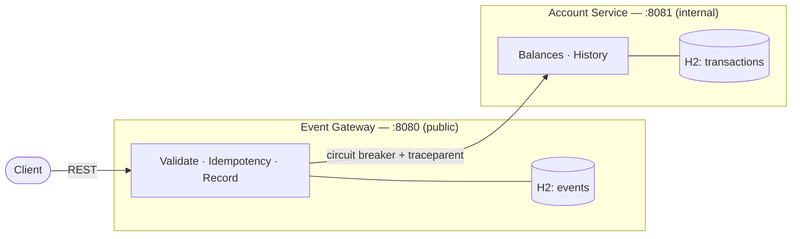

# Event Ledger

A two-service system that ingests financial transaction events and maintains account balances
correctly under real-world upstream conditions: events that arrive **out of order**, events
**delivered more than once**, and **partial outages** of a downstream service.



- **Event Gateway** (public) — validates input, enforces idempotency, records every event, and
  applies transactions to the Account Service through a circuit breaker.
- **Account Service** (internal) — owns account balances and transaction history; not exposed to
  external clients.

Each service is an independent Spring Boot process with its own in-memory database — no shared
database and no shared in-process state.

---

## Design decisions

The decisions most worth reviewing, with the reasoning behind each. Fuller explanations and the
trade-offs considered are in the [Architecture doc](docs/ARCHITECTURE.md#4-design-decisions).

- **Balance as a fold, not a stored running total.** Net balance is `Σ credits − Σ debits`, computed
  over the stored transactions with a database `SUM` aggregate. Modeling balance as a fold over a set
  — rather than a mutable counter — means arrival order is irrelevant and replays are inherently
  harmless, so out-of-order tolerance and idempotency follow from the data model instead of requiring
  reconciliation logic or a lock on a running total.
  [Details »](docs/ARCHITECTURE.md#42-out-of-order-tolerance--balance)

- **Idempotency that holds under concurrency.** `eventId` is the primary key, but a check-then-insert
  still races — two concurrent copies of the same event can both pass the existence check. The
  implementation instead attempts the insert and catches the primary-key violation, treating the loser
  of the race as a duplicate. The result is exactly-once application even under load, verified with a
  16-thread test. [Details »](docs/ARCHITECTURE.md#41-idempotency)

- **Circuit breaker with timeouts, chosen over retry.** The failure mode that matters here is a
  downstream outage, where retries only add load to an already-struggling service. A circuit breaker
  fails fast, gives the dependency time to recover, and self-heals through a half-open probe; paired
  timeouts prevent a slow dependency from exhausting the Gateway's request threads. When the Account
  Service is unavailable the fallback returns a clear `503` — and because the Gateway records each
  event in its own store first, the read endpoints keep serving throughout the outage.
  [Details »](docs/ARCHITECTURE.md#44-resiliency-circuit-breaker--timeout)

- **End-to-end distributed tracing.** A single client request produces one trace spanning both
  services, propagated by the W3C `traceparent` header and viewable as a waterfall in Jaeger — the
  basis for answering "where did this request slow down or fail?" across a service boundary.
  [Details »](docs/TOOLS.md#2-jaeger--distributed-tracing)

---

## Running the system

```bash
docker compose up --build
```

Starts both services and the observability stack — Gateway `:8080`, Jaeger UI `:16686`,
Prometheus `:9090`. The Gateway waits for the Account Service to be healthy before starting.
Without Docker, run `mvn -pl account-service spring-boot:run`, then the Gateway in a second terminal.

```bash
mvn test
```

24 automated tests covering core behavior, concurrency, resiliency, trace propagation, and the full
Gateway → Account integration. Requires JDK 21 — if your default `mvn` runs a newer JDK, set
`export JAVA_HOME=$(/usr/libexec/java_home -v 21)`.

---

## Documentation

| Topic | Document |
|---|---|
| How this was approached — decisions, lifecycle, and use of AI tooling | [Process & Decisions](docs/PROCESS.md) |
| Architecture and design, with diagrams (request flow, state machines, data model, deployment) | [Architecture & Design](docs/ARCHITECTURE.md) |
| Security review — threat model, current posture, and production recommendations | [Security Audit](docs/SECURITY.md) |
| Manual test walkthrough — every behavior, step by step, with `curl` examples | [Testing Walkthrough](docs/TESTING.md) |
| Observability and tooling — Jaeger, Prometheus, Swagger, IntelliJ | [Tools & Observability](docs/TOOLS.md) |

---

## Requirements & API

<details>
<summary><b>Requirement-by-requirement coverage</b></summary>

<br>

| Requirement | Implementation |
|---|---|
| **Idempotency** | `eventId` is the primary key in both stores, with an insert-and-catch that remains correct under concurrent duplicates. The original is returned on a repeat; balance is never altered twice. |
| **Out-of-order tolerance** | Listings sort by `eventTimestamp`; balance is an order-independent fold. |
| **Balance** | `Σ CREDIT − Σ DEBIT`, computed with a database `SUM` aggregate. |
| **Validation** | Bean Validation on the request DTO (`@NotBlank`/`@Size` ids, `@Positive` amount, enum-bound `type`, ISO-4217 `currency`) returns `400` with field-level messages. |
| **Service separation** | Two independent Spring Boot applications, each with its own H2 instance; no shared code or state. |
| **Distributed tracing** | Micrometer Tracing with the OpenTelemetry bridge; W3C `traceparent` propagated Gateway → Account; trace IDs in both services' logs. |
| **Structured logging** | JSON (Logback + Logstash encoder) with `timestamp`, `level`, `service`, `traceId`, `spanId`. |
| **Health checks** | `GET /health` on both services with a live database-connectivity check. |
| **Custom metrics** | `gateway_events_total` and `ledger_transactions_applied_total`, plus circuit-breaker state, exposed at `/actuator/prometheus`. |
| **Resiliency** | Resilience4j circuit breaker with connect/read timeouts on the Gateway → Account call. |
| **Graceful degradation** | Account Service down → `POST /events` returns `503`; `GET /events/{id}` and `?account=` continue to work; balance queries return a clear `503`. |
| **Docker Compose** | `docker compose up` starts both services and the observability stack. |
| **Automated tests** | 24 tests across core functionality, concurrency, resiliency, trace propagation, and integration. |

Design trade-offs and assumptions (duplicate returns `200`, one currency per account, and others)
are documented in the [Architecture doc](docs/ARCHITECTURE.md#7-trade-offs--alternatives).

</details>

<details>
<summary><b>API contract</b></summary>

<br>

**Event Gateway** (public, `:8080`)

| Method | Endpoint | Description |
|---|---|---|
| `POST` | `/events` | Submit a transaction event |
| `GET` | `/events/{id}` | Retrieve a single event (Gateway-local) |
| `GET` | `/events?account={id}` | List an account's events, ordered by `eventTimestamp` |
| `GET` | `/accounts/{id}/balance` | Balance, proxied to the Account Service through the circuit breaker |
| `GET` | `/health` | Health and database connectivity |

**Account Service** (internal, `:8081`)

| Method | Endpoint | Description |
|---|---|---|
| `POST` | `/accounts/{id}/transactions` | Apply a transaction (idempotent on `eventId`) |
| `GET` | `/accounts/{id}/balance` | Current balance with credit/debit counts |
| `GET` | `/accounts/{id}` | Account details and recent transactions |
| `GET` | `/health` | Health and database connectivity |

`POST /events` request body:

```json
{
  "eventId": "evt-001",
  "accountId": "acct-123",
  "type": "CREDIT",
  "amount": 150.00,
  "currency": "USD",
  "eventTimestamp": "2026-05-15T14:02:11Z",
  "metadata": { "source": "mainframe-batch" }
}
```

Status codes: `201` applied, `200` duplicate, `400` invalid input, `422` business-rule rejection
(e.g. currency mismatch), `503` Account Service unavailable. The full contract is also published as
OpenAPI at `/swagger-ui.html` on each service.

</details>

---

**Technology:** Java 21, Spring Boot 3.3, H2, Resilience4j, Micrometer with OpenTelemetry,
Logback (JSON), JUnit 5 with WireMock, and Docker Compose with Jaeger and Prometheus.
