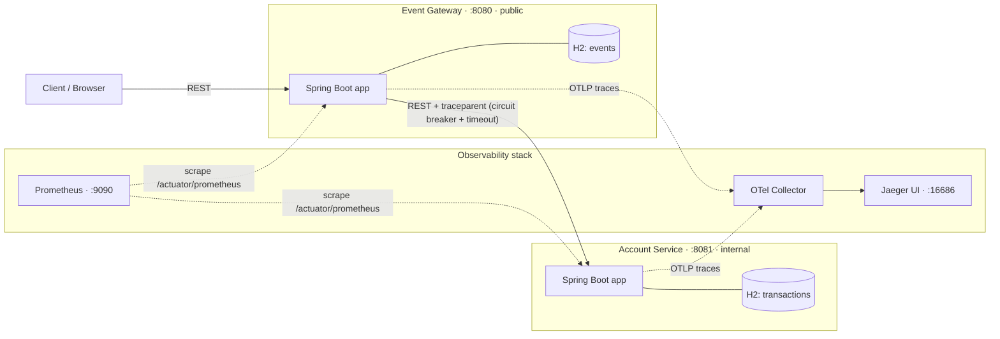
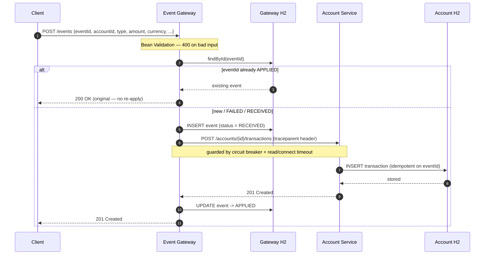
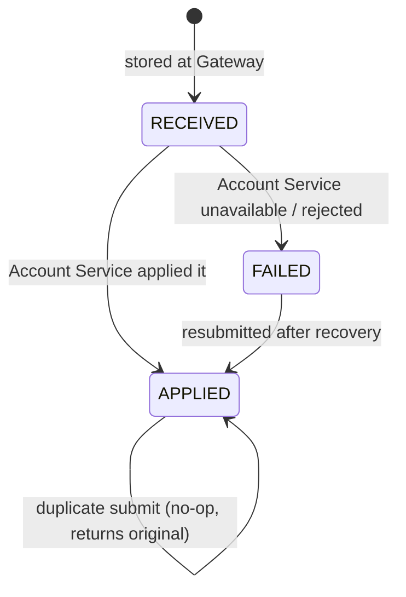
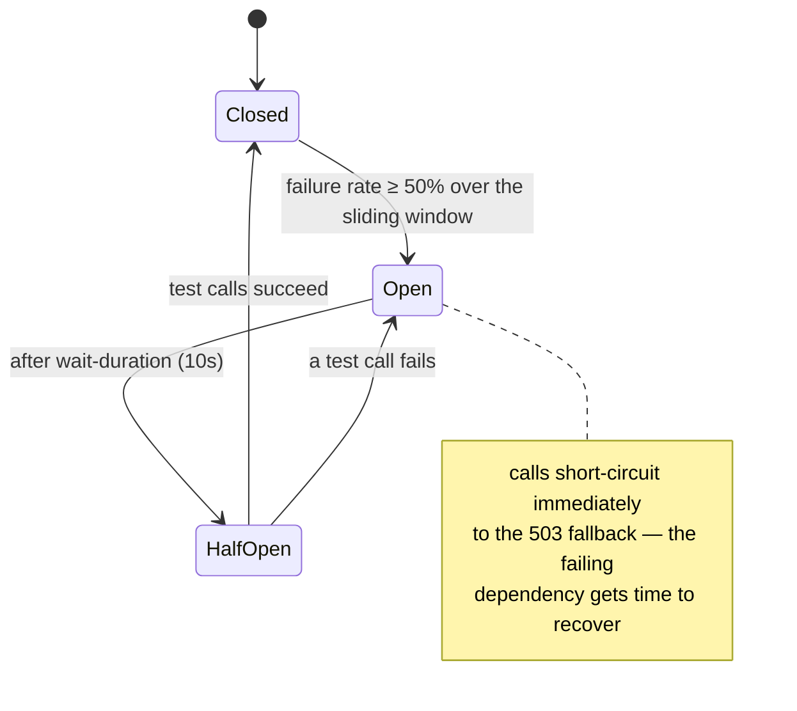
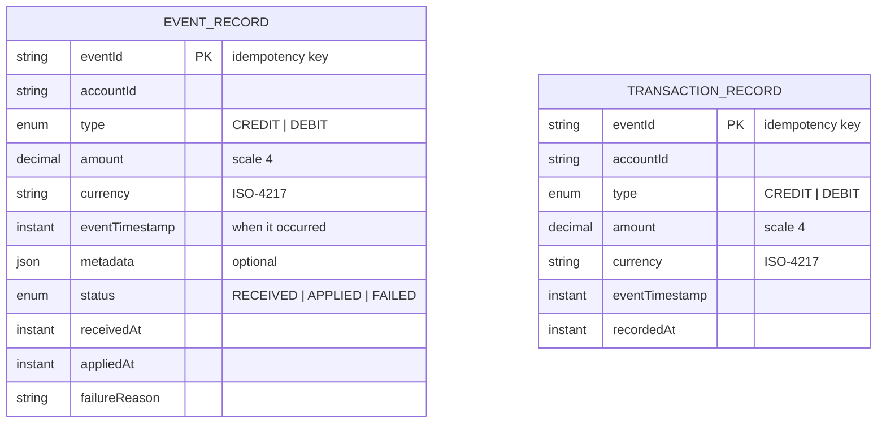
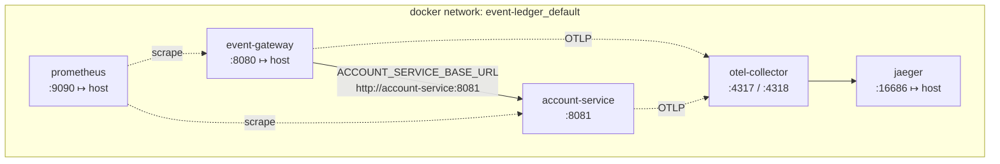

# Architecture & Design

How the Event Ledger is built and **why** it is built that way. Diagrams are written in
Mermaid, which GitHub renders inline.

> The system ingests financial transaction events from upstream systems that are **not
> synchronized**, so events can arrive **out of order** and **more than once**. It must stay
> correct under both, and **degrade gracefully** when a part is down.

## Contents

- [1. System overview](#1-system-overview)
- [2. The two services](#2-the-two-services)
- [3. Request lifecycle](#3-request-lifecycle)
- [4. Design decisions](#4-design-decisions)
  - [4.1 Idempotency](#41-idempotency)
  - [4.2 Out-of-order tolerance & balance](#42-out-of-order-tolerance--balance)
  - [4.3 Service separation & the contract](#43-service-separation--the-contract)
  - [4.4 Resiliency: circuit breaker + timeout](#44-resiliency-circuit-breaker--timeout)
  - [4.5 Graceful degradation](#45-graceful-degradation)
  - [4.6 Distributed tracing](#46-distributed-tracing)
  - [4.7 Observability](#47-observability)
- [5. Data model](#5-data-model)
- [6. Deployment topology](#6-deployment-topology)
- [7. Trade-offs & alternatives](#7-trade-offs--alternatives)

---

## 1. System overview

Two independent Spring Boot services, each with its **own** in-memory database, talking over
synchronous REST. A client only ever touches the **Gateway**; the **Account Service** is internal.



**Key property:** the two services share **no database and no in-process state**. They are linked
only by the `eventId` convention travelling over REST. Either can be deployed, scaled, or restarted
on its own.

---

## 2. The two services

### Event Gateway (public)
The entry point and system of record for **events**. It:
- validates input,
- enforces **idempotency** on `eventId`,
- stores every event locally (so reads survive an outage),
- calls the Account Service through a **circuit breaker**,
- exposes the event-listing and a proxied balance read.

### Account Service (internal)
The owner of **account state** — balances and transaction history. It:
- applies transactions idempotently,
- computes balances as `Σ CREDIT − Σ DEBIT`,
- enforces one currency per account,
- is never exposed to external clients (only the Gateway calls it).

**Why split them?** The brief asks for two services, but the split is also meaningful: the public
edge (validation, idempotency, resilience, rate-limiting in future) has very different concerns from
the ledger core (correctness, consistency, balance math). Separating them lets each evolve and scale
independently, and keeps the ledger off the public internet.

---

## 3. Request lifecycle

The happy path of `POST /events`, end to end:



A single client request produces **one trace** spanning both services (step 5 carries the
`traceparent`), so the whole path is visible as one waterfall in Jaeger.

---

## 4. Design decisions

### 4.1 Idempotency

**Requirement:** the same `eventId` submitted again must not double-apply or duplicate.

`eventId` is the **primary key** in both stores. The decision flow on submit:

```mermaid
flowchart TD
    start(["POST /events"]) --> validate{"Valid input?"}
    validate -->|No| badreq[["400 Bad Request"]]
    validate -->|Yes| lookup{"eventId exists?"}

    lookup -->|"Yes — APPLIED"| dup[["200 OK · return original"]]
    lookup -->|"Yes — FAILED / RECEIVED"| call
    lookup -->|No| insert["INSERT event (RECEIVED)"]

    insert -->|"PK collision (concurrent dup)"| race["catch → fetch winner → treat as duplicate"]
    insert -->|ok| call["Call Account Service"]
    race --> call

    call --> outcome{Outcome}
    outcome -->|Success| applied[["mark APPLIED · 201 / 200"]]
    outcome -->|"Account down / breaker open"| degraded[["mark FAILED · 503 (retryable)"]]
    outcome -->|"4xx business reject"| rejected[["mark FAILED · forward 4xx"]]
```

Two subtleties that make this **actually** correct:

1. **Concurrency.** A naive `findById` then `save` races — two simultaneous duplicates both pass the
   check. Entities implement `Persistable` so `save()` is a real `INSERT` (an assigned id otherwise
   makes Spring Data silently *merge*). The loser of the primary-key race catches
   `DataIntegrityViolationException` and returns the winner as a duplicate → **exactly one apply**.
2. **Partial failure.** Only an `APPLIED` event short-circuits. A `FAILED`/`RECEIVED` event is
   **re-attempted** on resubmission — safe because the Account Service is *itself* idempotent on
   `eventId`. So a lost response or a transient outage never permanently strands an event.

The event's lifecycle:



### 4.2 Out-of-order tolerance & balance

**Balance is a fold, not a running total.** It is computed as `Σ CREDIT − Σ DEBIT` over the stored
transactions (a database `SUM` aggregate). Because it's a fold over a *set*:

- **arrival order is irrelevant** — the sum is the same however the events interleave, and
- **replays are harmless** — the primary key means a duplicate never enters the sum.

So the two hard requirements (out-of-order, duplicates) fall out of the **data model**, not from
special-case code. Event *listings* are simply ordered by `eventTimestamp` at query time.

> Scale note: the balance uses `SUM`/`COUNT` queries rather than loading every row, and the account
> view pages recent transactions at the database — O(1) work for the service regardless of history size.

### 4.3 Service separation & the contract

Each service is its own Maven module, its own process, its own H2 instance. The **contract** between
them — the `POST /accounts/{id}/transactions` request/response — is owned by the Account Service and
published as **OpenAPI** (`/swagger-ui.html`). The Gateway keeps its *own* copy of the client DTOs
rather than sharing a jar, so a shared library can never quietly couple the two services' internals.

### 4.4 Resiliency: circuit breaker + timeout

The Gateway guards every call to the Account Service with a **Resilience4j circuit breaker** plus
**connect/read timeouts**.



- **Timeout** bounds how long a slow dependency can hold a Gateway request thread — a slow Account
  Service can't cascade into Gateway-wide thread exhaustion.
- **Circuit breaker** stops hammering a service that's already failing: once the failure rate crosses
  the threshold it **opens** and fails fast to a fallback, then probes (**half-open**) before closing.

**Why this over retry?** The failure mode we care about is a *downstream outage* — exactly where
retries make things worse (they amplify load on a struggling service). A breaker fails fast and
self-heals. A 4xx from the Account Service is configured as `ignore-exceptions`, so a business/data
error never trips the breaker — only genuine outages and timeouts do.

### 4.5 Graceful degradation

When the Account Service is unavailable, the breaker's fallback raises a typed exception that maps to
a clear **503** — never a hang or a 500. Crucially, the split of state lets reads keep working:

| Operation | Depends on | While Account Service is down |
|---|---|---|
| `GET /events/{id}` | Gateway's own H2 | ✅ works |
| `GET /events?account=` | Gateway's own H2 | ✅ works |
| `POST /events` | Account Service | ❌ 503 — event saved locally as `FAILED` (retryable) |
| `GET /accounts/{id}/balance` | Account Service | ❌ 503 — clear "unreachable" error |

The Gateway commits the event **before** the downstream call (each save is its own transaction), so
the local record survives the failure — which is *what makes* the read endpoints stay available.

### 4.6 Distributed tracing

Tracing uses **Micrometer Tracing with the OpenTelemetry bridge**. A trace is created for each
inbound request at the Gateway; the W3C `traceparent` header is propagated automatically on the
outbound `RestClient` call; both services put `traceId`/`spanId` into the logging MDC. The result:
one client request = one trace = one waterfall across both services in Jaeger.

### 4.7 Observability

- **Structured logs** — JSON (Logback + Logstash encoder) with `timestamp`, `level`, `service`,
  `traceId`, `spanId`.
- **Health** — `GET /health` on both services with a live DB-connectivity check.
- **Metrics** — Micrometer counters (`gateway_events_total`, `ledger_transactions_applied_total`)
  plus circuit-breaker state, exposed at `/actuator/prometheus` and scraped by Prometheus.

---

## 5. Data model

Two tables, **one per service** — there is intentionally **no foreign key between them** (they live
in different databases). They are correlated only by the shared `eventId`.



- **`EVENT_RECORD`** (Gateway) is the audit log of *what was submitted* and *what happened to it*
  (the `status` field). It is the source of truth for the event-listing endpoints.
- **`TRANSACTION_RECORD`** (Account Service) is the immutable ledger that *balances are folded from*.

The same `eventId` keys both, which is what lets a Gateway retry be safely de-duplicated by the
Account Service.

---

## 6. Deployment topology

`docker compose up` starts five containers on one network:



- The Gateway waits for the Account Service's healthcheck before starting (`depends_on: healthy`).
- Services resolve each other by **compose DNS name**, not host ports.
- Images are multi-stage (Maven build → slim JRE) and run as a **non-root** user.
- In production the Account Service's host port would not be published (see `docs/SECURITY.md`).

---

## 7. Trade-offs & alternatives

| Decision | Chosen | Alternative | Why |
|---|---|---|---|
| Idempotency | PK + insert-and-catch | distributed lock / dedup table | simplest correct option; no extra infra |
| Balance | fold via DB `SUM` | maintained running-total column | correctness is trivial; no update-race on a counter |
| Resiliency | circuit breaker + timeout | retry with backoff | outage is the main risk; retries amplify it |
| Duplicate response | `200` + original | `409 Conflict` | signals "already satisfied" idempotent success |
| Inter-service contract | duplicated DTOs + OpenAPI | shared jar | avoids hidden coupling between services |
| Failed-event recovery | client resubmit (re-attempt) | background reaper / queue | keeps scope tight; reaper is documented future work |

**Known future work:** authentication/authorization, rate limiting, an async fallback queue (replay
`FAILED` events automatically on recovery), and contract tests (Pact) between the services. See
`docs/SECURITY.md` for the security posture and `README.md` for the requirement-by-requirement map.
