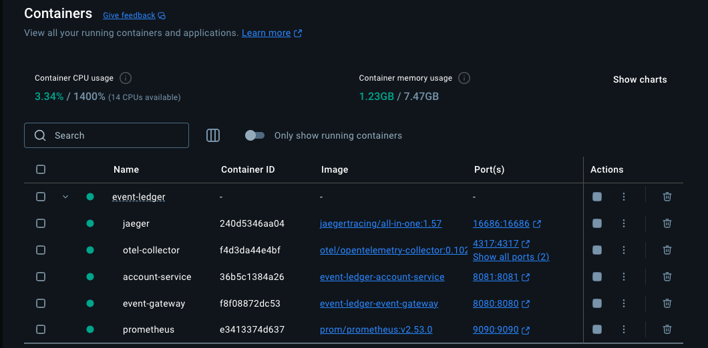
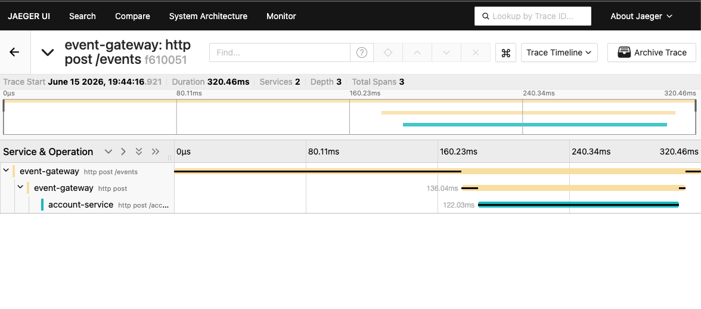
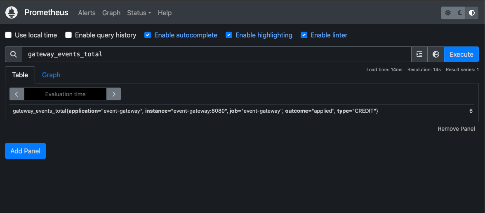
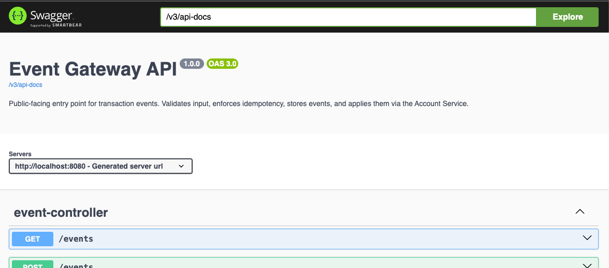

# Tools & Observability (Demo Guide)

The tools that let you **run, watch, and explore** the system. Each section has:
what it **is**, how to **open** it, what to **look for**, and **why it matters**.

> **Observability** = being able to *see what your system is doing* from the outside:
> traces (what happened), metrics (the numbers), logs (the details).

| Tool | What it gives you | URL |
|---|---|---|
| **Docker Compose** | Runs all 5 pieces with one command | — |
| **Jaeger** | Visual map of one request across services | http://localhost:16686 |
| **Prometheus** | Live numbers + graphs | http://localhost:9090 |
| **Swagger** | Click-to-try API docs | http://localhost:8080/swagger-ui.html |
| **`mvn test`** | 16 automated tests | — |

---

## Table of Contents

1. [Docker Compose — run everything](#1-docker-compose--run-everything)
2. [Jaeger — distributed tracing](#2-jaeger--distributed-tracing)
3. [Prometheus — metrics](#3-prometheus--metrics)
4. [Swagger — API docs](#4-swagger--api-docs)
5. [Automated tests](#5-automated-tests)
6. [Image vs Container (quick note)](#6-image-vs-container-quick-note)

---

## 1. Docker Compose — run everything

**What it is:** one command that starts **all 5 containers** together — both services
plus the observability stack (Jaeger, OTel Collector, Prometheus).

> ⚠️ Stop the local `java -jar` copies first — Docker needs ports 8080/8081:
> ```bash
> pkill -f account-service-1.0.0.jar
> pkill -f event-gateway-1.0.0.jar
> ```

**Start the stack:**

```bash
cd ~/Developer/prototype/Schwab/event-ledger
docker compose up --build      # add -d to run in the background
```

**Check status:**

```bash
docker compose ps
```

**Expect** 5 rows, services showing `healthy`:

| Container | Role |
|---|---|
| account-service | internal service |
| event-gateway | public service |
| jaeger | trace viewer |
| otel-collector | receives traces, forwards to Jaeger |
| prometheus | metrics collector |


*Docker Desktop — all 5 containers running under the `event-ledger` stack.*

**Stop the stack:**

```bash
docker compose down
```

> 💡 Docker databases are in-memory — `down` wipes the data. Fresh start every time.

---

## 2. Jaeger — distributed tracing

**What it is:** a **map** that follows **one request** as it travels across services.
Each step is a **span**; spans share **one trace id**, so they link into one picture.

**First, make a request to trace:**

```bash
curl -s -X POST http://localhost:8080/events \
  -H "Content-Type: application/json" \
  -d '{
    "eventId": "trace-001",
    "accountId": "acct-123",
    "type": "CREDIT",
    "amount": 99.00,
    "currency": "USD",
    "eventTimestamp": "2026-05-15T14:02:11Z"
  }'
```

**Open Jaeger:** http://localhost:16686

1. **Service** dropdown (top-left) → select **`event-gateway`**
2. Click **Find Traces**
3. Click the top trace (`http post /events`)

**What you'll see — a waterfall of 3 spans:**

```
event-gateway: http post /events                         ← whole request arrives
  └─ event-gateway: http post                            ← gateway calls out
       └─ account-service: http post /accounts/.../transactions  ← account does the work
```


*One request, 3 spans across 2 services. Yellow = Gateway, teal = Account Service. The teal bar sits inside the yellow → the Gateway was waiting on the Account Service.*

**How to read it:**

- Left → right = **time** (this one took ~320ms)
- **Yellow** bars = work in the **Gateway**
- **Teal** bar = work in the **Account Service**
- The teal bar sits **inside** the yellow → the Gateway was **waiting** on the Account Service

**Why it matters:** with many services, this is how you answer *"why was this slow?"*
or *"where did it fail?"* — find the trace, look for the long or red bar.

> 🔑 The Gateway passes a **`traceparent`** header to the Account Service. That header
> is what lets Jaeger stitch the separate spans into one trace.

---

## 3. Prometheus — metrics

**What it is:** a **fitness tracker** for the app. It visits each service's
`/actuator/prometheus` page every few seconds and saves the numbers, so you can graph them.

**Open Prometheus:** http://localhost:9090

In the **search box**, type a metric name and press **Enter**. Click the **Graph** tab
to see it over time. (The query language is called **PromQL**.)

**Useful metrics to try:**

| Type this | Shows |
|---|---|
| `gateway_events_total` | how many events came in (by type & outcome) — our custom metric |
| `ledger_transactions_applied_total` | transactions applied in the Account Service |
| `resilience4j_circuitbreaker_state` | the "fuse" — look for `state="closed" = 1` 🟢 |
| `up` | are the services alive? `1` = up, `0` = down |
| `http_server_requests_seconds_count` | request counts per endpoint |


*Querying our custom metric `gateway_events_total` — broken down by `type` and `outcome`, here showing 6 applied CREDITs.*

**Make a number climb 📈** — fire 5 events, then re-run `gateway_events_total`:

```bash
for i in 1 2 3 4 5; do
  curl -s -o /dev/null -X POST http://localhost:8080/events \
    -H "Content-Type: application/json" \
    -d "{\"eventId\":\"p-$i\",\"accountId\":\"acct-123\",\"type\":\"CREDIT\",\"amount\":10,\"currency\":\"USD\",\"eventTimestamp\":\"2026-05-15T14:00:00Z\"}"
done
```

**Why it matters:** in real life you don't watch logs all day — you let Prometheus watch
the numbers and **alert** you when something spikes (errors, breaker tripping).

---

## 4. Swagger — API docs

**What it is:** an auto-generated webpage that **lists every endpoint** and lets you
**try them in the browser** — no curl needed. Great for a teammate or interviewer.

**Open:**

- Gateway: http://localhost:8080/swagger-ui.html
- Account Service: http://localhost:8081/swagger-ui.html


*The Event Gateway API in Swagger — every endpoint listed and runnable from the browser.*

**Try an endpoint:**

1. Click an endpoint to expand it (e.g. `GET /accounts/{accountId}/balance`)
2. Click **Try it out**
3. Fill in the field (e.g. `accountId` = `acct-123`)
4. Click **Execute**
5. See the live response right on the page

**Why it matters:** it's the "front door" to the API — anyone can explore it without
reading code or knowing curl.

---

## 5. Automated tests

**What it is:** 16 tests that run **without any clicking** and prove the code works.
They're the safety net — run them after any code change.

```bash
cd ~/Developer/prototype/Schwab/event-ledger
export JAVA_HOME=$(/usr/libexec/java_home -v 21)
mvn test
```

**Expect, near the end:**

```
Account Service .... SUCCESS
Event Gateway ...... SUCCESS
BUILD SUCCESS
```

**What they cover:**

| Module | Tests | Covers |
|---|---|---|
| Account Service | 8 | idempotency, out-of-order balance, CREDIT−DEBIT fold, validation, health |
| Event Gateway | 8 | full flow, idempotent duplicate, validation, ordering, **circuit breaker opens**, **503 degradation**, **trace propagation** |

**Why it matters:** the manual curl tests check it *once, by hand*. These check it
*every time, automatically* — so you catch a break the moment you introduce it.

---

## 6. Image vs Container (quick note)

- **Image** = a **blueprint** 📜 (a frozen, ready-to-run copy of an app)
- **Container** = a **running** copy made from a blueprint ▶️

In Docker Desktop, the **Images** list shows blueprints. An empty circle (○) = stopped;
a green dot (●) = a container is running from it. `docker compose up` turns blueprints
into running containers; `docker compose down` stops them (the blueprints stay, so the
next start is fast).
